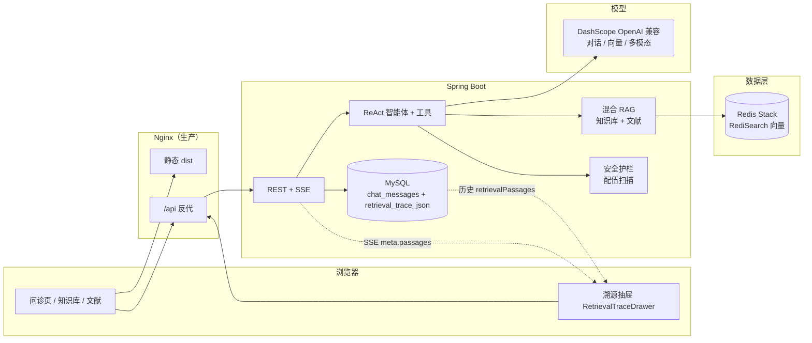

# TCM Intelligent Inquiry（中医智能问诊）

面向症状分析、体质辨识与个性化调理建议的 **RAG 2.0 + 安全护栏** 全栈系统：混合检索（向量 + 关键词）、异步 SSE 流式输出、问诊报告结构化抽取与 **「十八反 / 十九畏」** 字面规则扫描；支持 **溯源看板**，将每轮助手回复背后的 Top 检索片段与流式/历史 API 对齐。

---

## 架构总览



- **RAG 2.0**：向量相似度与 RediSearch 全文/标签混合召回，专名词增强；文献库与知识库通道在溯源中区分（`channel`: `knowledge` / `literature`）。
- **异步与流式**：问诊主路径使用 SSE；溯源片段在 **meta 事件** 中与最终落库的 **Top 3** 片段经同一套 `RetrievalTraceSupport.finalizeTop` 规整，保证 **UI 与持久化一致**。
- **安全护栏**：`TcmSafetyGuardrailService` 对报告中的药材列表做 **内置字面规则** 扫描（非临床处方可程序化覆盖的歌诀级「十八反」「十九畏」），结果展示于诊断报告卡；**不能替代执业药师审方**。

---

## 中医领域与安全说明

| 能力 | 说明 |
|------|------|
| 配伍禁忌引擎 | 基于经典歌诀的 **字符串规则库**（如乌头反半夏、甘草反甘遂、藜芦反诸参等），对称匹配药材名；命中则报告卡展示告警行。 |
| 边界 | 规则为 **教育 / 演示向** 的字面扫描，未纳入炮制名、别名图谱、剂量与证候禁忌；生产环境仍需人工复核。 |

---

## 溯源看板（Explainability）

- **前端**：`frontend/src/views/consultation/components/RetrievalTraceDrawer.vue` — 左侧 `el-drawer`，时间轴展示 `passages`（匹配类型、分值、`channel`），并对用户问句关键词在 `excerpt` 中做 **转义后高亮**（降低 XSS 风险）。
- **后端**：助手消息对应表字段 `retrieval_trace_json`（LOB），保存 **序列化后的 Top 3** `KnowledgeRetrievedPassage`；`GET .../messages` 反序列化为 `retrievalPassages`。**仅增加一次写入与历史读取时的 JSON 解析，不参与热路径向量检索。**

---

## 快速开始（本地开发）

**依赖**：**MySQL 8**、**Redis Stack**（含 RediSearch；普通 Redis OSS 不足以支撑 `RedisVectorStore`）、**DashScope API Key**（`application.yml` 中 OpenAI 兼容入口已指向百炼）。业务库 **禁止 SQLite**（与 JPA 方言及工程约定一致）。

```bash
# 1. MySQL / Redis 自行安装或使用下文 Docker Compose
# 2. 配置环境变量（示例）
export MYSQL_HOST=127.0.0.1 MYSQL_USER=root MYSQL_PASSWORD=你的密码 MYSQL_DATABASE=tcm_inquiry
export REDIS_HOST=127.0.0.1 REDIS_PORT=6379
export DASHSCOPE_API_KEY=你的_Key

# 3. 后端
cd backend && ./mvnw spring-boot:run

# 4. 前端（开发态 /api 代理到 8080）
cd frontend && npm ci && npm run dev
```

质量检查：`frontend` 下 `npm run lint`、`npm test`、`npm run build`；`backend` 下 `./mvnw test`。

---

## 一键部署（Docker）

仓库根目录提供 **多阶段构建** 后端镜像、`docker/Dockerfile.frontend` + Nginx、以及 **`deploy.sh`**（先本地 `npm run build` 校验，再 `docker compose up`）。

```bash
chmod +x deploy.sh
# 建议在 shell 或 .env 中设置 DASHSCOPE_API_KEY，勿将密钥提交到 Git
./deploy.sh
```

- **访问**：前端默认 `http://localhost:80`，后端直连 `http://localhost:8080`（可通过 `HTTP_PORT` / `BACKEND_PORT` 覆盖）。
- **数据持久化**：命名卷 `tcm_mysql_data`、`tcm_redis_data`；重新 `up` 不丢库与向量索引。

### 代理（境外模型或多跳出口）

若 DashScope 或其它 HTTP 客户端需走企业代理，可在 Compose 环境或宿主机中设置：

- `HTTP_PROXY` / `HTTPS_PROXY`
- `NO_PROXY`：默认已包含 `localhost,127.0.0.1,mysql,redis,backend,frontend`，可按内网段增补。

JVM 容器内亦可增加 `JAVA_OPTS`，例如：`-Dhttp.proxyHost=...`（按需）。

### Compose 服务一览

| 服务 | 镜像 / 构建 | 说明 |
|------|-------------|------|
| `mysql` | `mysql:8.4` | 业务库；健康检查后启动 `backend` |
| `redis` | `redis/redis-stack-server` | 向量 + RediSearch |
| `backend` | `backend/Dockerfile` | Spring Boot fat JAR |
| `frontend` | `docker/Dockerfile.frontend` | Nginx 托管 `dist`，`/api` → `backend:8080` |

---

## 主要 API 与模块（摘要）

- **问诊 SSE**：`POST /api/v1/consultation/chat`，`Accept: text/event-stream`；meta 中带 `passages`（与落库对齐的溯源结构）。
- **历史消息**：`GET /api/v1/consultation/sessions/{id}/messages`，助手消息含 `retrievalPassages`。
- **知识库 / 文献**：`/api/v1/knowledge/*`、`/api/v1/literature/*`（上传、混合检索、流式问答等）。

---

## 环境变量（后端）

| 变量 | 说明 |
|------|------|
| `MYSQL_*` | 见 `application.yml` 组装 JDBC |
| `REDIS_*` | Redis Stack 连接 |
| `DASHSCOPE_API_KEY` / `DASHSCOPE_BASE_URL` | 兼容模式根 URL，**勿** 在 path 末尾多写 `/v1` |
| `SPRING_AI_OLLAMA_*` 等 | 若扩展本地 Ollama，需自行加依赖与配置（当前默认向量/对话走 DashScope） |
| `TCM_API_EXPOSE_ERROR_DETAILS` | 生产建议关闭错误详情外泄 |

前端开发：`VITE_API_PROXY_TARGET`（仅 `vite dev` 使用）；生产构建使用 **同源 `/api`**，由 Nginx 反代。

---

## 仓库结构约定

- 业务包：`modules/consultation`、`knowledge`、`literature`、`agent`；新增 JPA 实体请在各自模块保留 `*JpaConfig`（`@EntityScan` + `@EnableJpaRepositories`）。
- 并行开发：避免无关模块的 `pom.xml` / 根 `application.yml` 大范围改动。

---

## 安全与贡献

- [SECURITY.md](SECURITY.md)
- [CONTRIBUTING.md](CONTRIBUTING.md)
